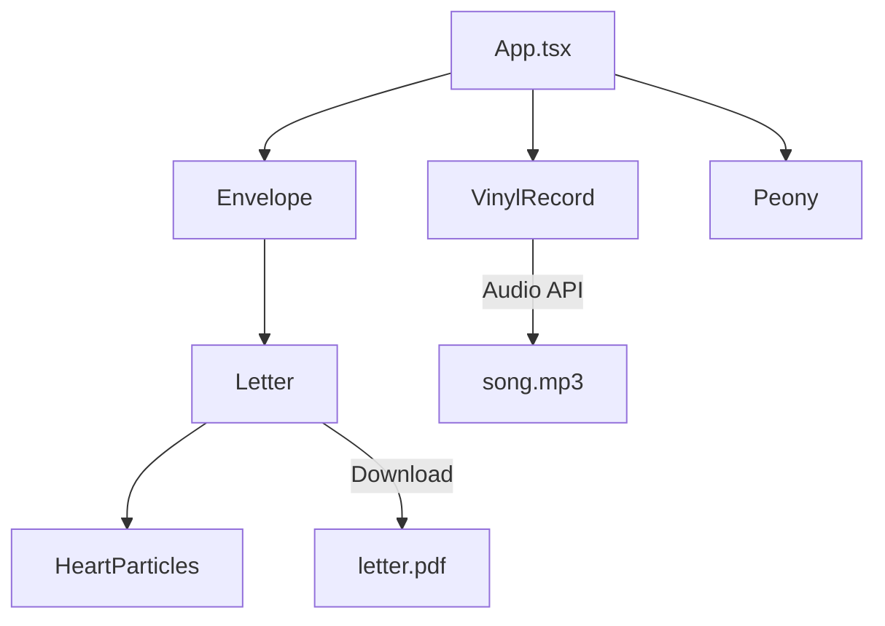

# 🎵 Vinyl Love Letter - Projekt Übersicht

## 🎯 Projektziel
Eine romantische, interaktive Webseite für Tatjana mit:
- Drehender Vinyl-Schallplatte mit Musikwiedergabe
- Animierter Briefumschlag der sich öffnet
- Brief der herausfliegt und als PDF heruntergeladen werden kann
- Herz-Animation beim Öffnen des Briefs

---

## 🛠️ Tech Stack

| Kategorie | Technologie | Begründung |
|-----------|-------------|------------|
| **Framework** | React + TypeScript | Type-safety, moderne Entwicklung |
| **Build Tool** | Vite | Schnelles HMR, optimale Performance |
| **Animation** | Framer Motion | GPU-beschleunigte Animationen, deklarative API |
| **Styling** | CSS Modules / Vanilla CSS | Volle Kontrolle über Design |
| **Icons** | Lucide React | Elegante, anpassbare Icons |

---

## 📁 Geplante Projektstruktur

```
src/
├── components/
│   ├── VinylRecord/
│   │   ├── VinylRecord.tsx
│   │   └── VinylRecord.css
│   ├── Envelope/
│   │   ├── Envelope.tsx
│   │   └── Envelope.css
│   ├── Letter/
│   │   ├── Letter.tsx
│   │   └── Letter.css
│   ├── HeartParticles/
│   │   ├── HeartParticles.tsx
│   │   └── HeartParticles.css
│   └── Peony/
│       ├── Peony.tsx        # SVG Pfingstrose
│       └── Peony.css
├── assets/
│   ├── song.mp3          # Musik (vom User bereitgestellt)
│   ├── letter.pdf        # Brief PDF (vom User bereitgestellt)
│   └── vinyl-label.png   # Optional: Custom Label
├── App.tsx
├── App.css
├── main.tsx
└── index.css
```

---

## 📦 Benötigte Assets vom User

> [!IMPORTANT]
> Diese Dateien müssen vor dem Entwickeln bereitgestellt werden:

| Asset | Format | Beschreibung |
|-------|--------|--------------|
| **Song** | `.mp3` / `.wav` | Musik die beim Drehen der Platte abspielt |
| **Brief PDF** | `.pdf` | Der Brief zum Herunterladen |
| **Vinyl Label** | `.png` / `.svg` (optional) | Custom Bild für die Mitte der Platte |

---

## 🎨 Design Vorgaben

- **Hintergrund**: Helles Lila/Lavender (`#E6E0F8` oder ähnlich)
- **Vinyl**: Dunkles Schwarz mit Grooves-Effekt
- **Umschlag**: Cremefarben mit Schatten
- **Herzen**: Pink/Rot Gradient
- **Typografie**: Inter oder ähnliche moderne Sans-Serif

---

## 📐 Layout Konzept

```
┌──────────────────────────────────────┐
│                                      │
│          ╭──────────────╮            │
│          │              │            │
│          │    VINYL     │   ← Dreht sich
│          │    RECORD    │     & spielt Musik
│          │              │            │
│          ╰──────────────╯            │
│                                      │
│          ┌──────────────┐            │
│          │   ENVELOPE   │   ← Klickbar
│          │   📧         │     öffnet sich
│          └──────────────┘            │
│                                      │
│             🌸 PEONY 🌸              │  ← SVG Pfingstrose
│          (subtil animiert)           │     mit Breathing Animation
│                                      │
│   (Helles Lila Hintergrund)          │
│                                      │
└──────────────────────────────────────┘
```

---

## 🔗 Komponenten-Abhängigkeiten



---

## ✅ Nächste Schritte

1. [ ] Assets vom User erhalten (Song, PDF)
2. [ ] Vite + React + TypeScript Projekt aufsetzen
3. [ ] Framer Motion installieren
4. [ ] Komponenten implementieren (siehe einzelne Docs)
5. [ ] Animations-Feintuning
6. [ ] Testing & Deployment
