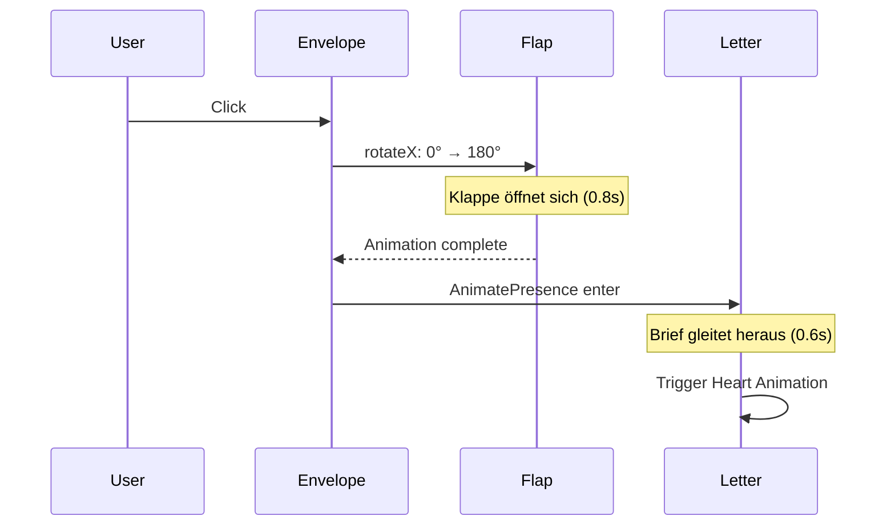

# 📧 Envelope Component

## 📋 Übersicht

Der Briefumschlag befindet sich unter der Vinyl-Platte. Im geschlossenen Zustand zeigt er eine Klappe nach oben. Bei Klick öffnet sich die Klappe mit einer 3D-Animation und der Brief kommt heraus.

---

## 🎯 Anforderungen

| Feature | Beschreibung |
|---------|--------------|
| **Zustand** | Geschlossen → Öffnend → Offen |
| **Animation** | Klappe öffnet sich nach hinten (3D flip) |
| **Trigger** | Klick auf den Umschlag |
| **Inhalt** | Brief-Komponente wird sichtbar |

---

## 🔧 Technische Umsetzung

### Komponenten-Struktur

```tsx
// Envelope.tsx
import { useState } from 'react';
import { motion, AnimatePresence } from 'framer-motion';
import Letter from '../Letter/Letter';

const Envelope = () => {
  const [isOpen, setIsOpen] = useState(false);

  return (
    <div className="envelope-container">
      {/* Umschlag Body */}
      <motion.div 
        className="envelope-body"
        onClick={() => !isOpen && setIsOpen(true)}
      >
        {/* Klappe */}
        <motion.div
          className="envelope-flap"
          animate={{
            rotateX: isOpen ? 180 : 0
          }}
          transition={{
            duration: 0.8,
            ease: "easeInOut"
          }}
          style={{
            transformOrigin: "top center",
            transformStyle: "preserve-3d"
          }}
        />
        
        {/* Brief (erscheint nach Öffnung) */}
        <AnimatePresence>
          {isOpen && <Letter />}
        </AnimatePresence>
      </motion.div>
    </div>
  );
};
```

---

## 🎨 CSS 3D Transforms

### Envelope Styling

```css
.envelope-container {
  perspective: 1000px;
  width: 300px;
  height: 200px;
  position: relative;
}

.envelope-body {
  width: 100%;
  height: 100%;
  position: relative;
  background: linear-gradient(135deg, #f5f0e8, #e8e0d5);
  border-radius: 8px;
  box-shadow: 
    0 10px 30px rgba(0, 0, 0, 0.2),
    inset 0 -5px 10px rgba(0, 0, 0, 0.05);
  cursor: pointer;
  transform-style: preserve-3d;
}

/* Klappe (geschlossen) */
.envelope-flap {
  position: absolute;
  top: 0;
  left: 0;
  width: 100%;
  height: 50%;
  
  /* Dreiecks-Form mit clip-path */
  clip-path: polygon(0 0, 50% 100%, 100% 0);
  
  background: linear-gradient(180deg, #e8e0d5, #d4c8b8);
  transform-origin: top center;
  transform-style: preserve-3d;
  z-index: 10;
}

/* Rückseite der Klappe */
.envelope-flap::after {
  content: '';
  position: absolute;
  width: 100%;
  height: 100%;
  background: #c9bba8;
  transform: rotateX(180deg);
  backface-visibility: hidden;
}
```

---

## 📐 Animations-Sequenz



---

## 🎯 Animation Timing

| Phase | Dauer | Beschreibung |
|-------|-------|--------------|
| **Klappe öffnen** | 0.8s | `rotateX: 0 → 180°` |
| **Pause** | 0.2s | Kurze Verzögerung |
| **Brief herausgleiten** | 0.6s | `translateY: 100% → 0` |
| **Herzen starten** | 0s | Gleichzeitig mit Brief |

---

## 🔄 State Management

```tsx
type EnvelopeState = 'closed' | 'opening' | 'open';

const [state, setState] = useState<EnvelopeState>('closed');

// State Transitions
const openEnvelope = async () => {
  setState('opening');
  await delay(800);  // Warte auf Klappe
  setState('open');
};
```

---

## ✨ Zusätzliche Details

### Interaktive Elemente

- **Hover-Effekt**: Leichtes Anheben bei Hover
- **Cursor**: `cursor: pointer` wenn geschlossen
- **Schatten**: Dynamischer Schatten beim Öffnen

### Animation Spring Config

```tsx
transition={{
  type: "spring",
  stiffness: 100,
  damping: 15,
  mass: 0.5
}}
```

---

## 🔗 Abhängigkeiten

- `framer-motion` für Animationen
- `Letter` Komponente (Child)
- CSS 3D Transform Support (alle modernen Browser)
